<div align="center">

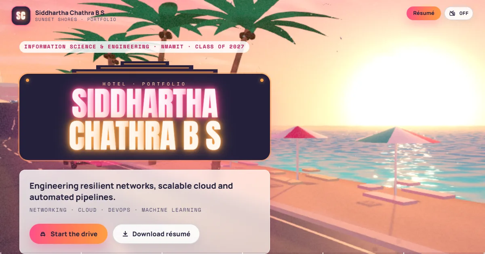

# Sunset Shores

### The 3D portfolio of **Siddhartha Chathra B S**

**Take a drive down a golden-hour coastal highway. Every stop on the road is a chapter of my work.**

<p>
  
  
  
  
  
  
</p>

<p>
  <a href="#-the-drive"><b>The drive</b></a> ·
  <a href="#-highlights"><b>Highlights</b></a> ·
  <a href="#-on-your-phone"><b>Mobile</b></a> ·
  <a href="#-run-it-locally"><b>Run it</b></a> ·
  <a href="#-under-the-hood"><b>Under the hood</b></a> ·
  <a href="#-say-hello"><b>Contact</b></a>
</p>

</div>

---

## 🌅 About this project

Most portfolios are a scrolling list. This one is a **place**.

Scroll and the camera drives along Ocean Drive, past art-deco hotels, palm-lined promenades, a billboard highway and a marina, all at golden hour. Every stop is a section of the portfolio. The content lives inside **Sunset OS**, an in-world phone: a Profile app, a Projects feed, a Messages thread for experience, a Stats app for skills and a Contacts card.

Everything 3D is **procedural**: no downloaded models, textures or HDRIs, and the music is composed in code. It runs on phones, respects reduced-motion settings, and falls back to pre-rendered postcards on devices without a capable GPU.

> The art direction is inspired by golden-hour coastal cities in modern open-world games. No game names, logos, characters, screenshots, ripped assets or official music are used. See [CREDITS.md](CREDITS.md).

---

## 🛣️ The drive

<table>
  <tr>
    <td width="50%" valign="top">
      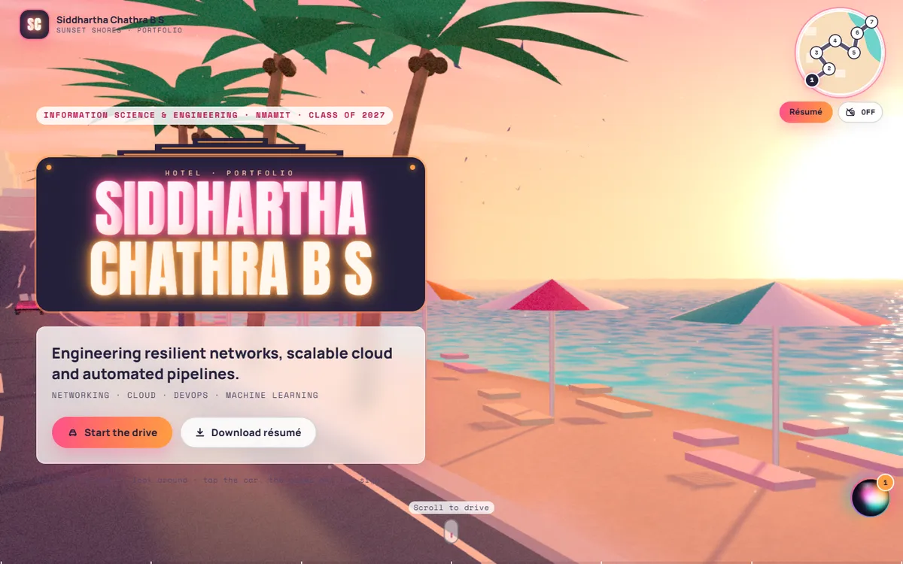
      <h3>01 · Ocean Drive</h3>
      A neon hotel sign spells out my name above the beach. Drag the street to look around; tap the cars to honk and the palms to send a gust through them.
    </td>
    <td width="50%" valign="top">
      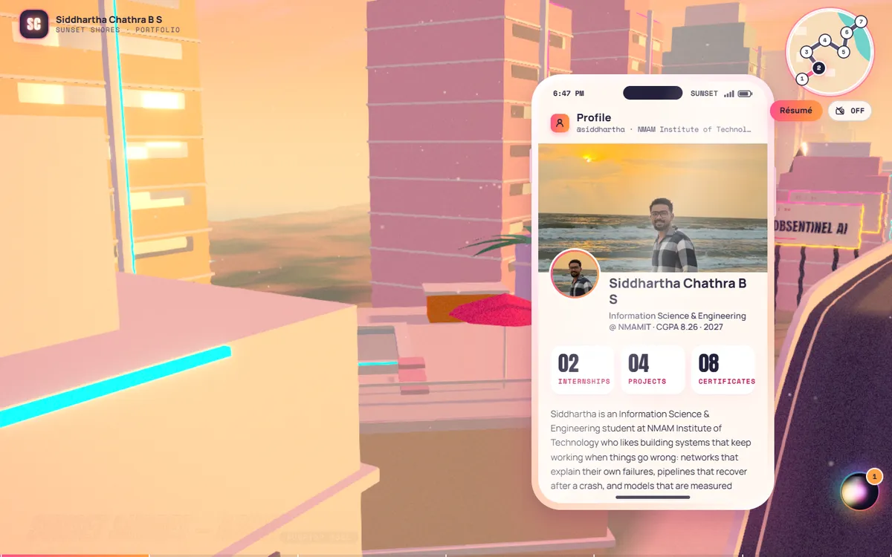
      <h3>02 · Rooftop Pool</h3>
      The <b>Profile</b> app: who I am, my education and quick stats, read as the page scrolls past a rooftop pool.
    </td>
  </tr>
  <tr>
    <td width="50%" valign="top">
      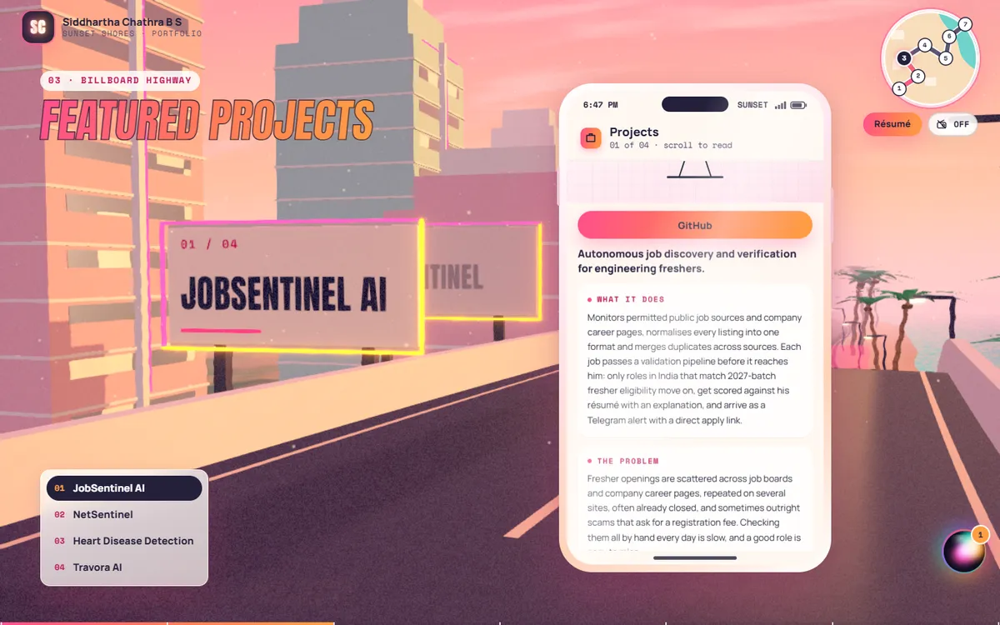
      <h3>03 · Billboard Highway</h3>
      Each project gets a billboard on the flyover and a full case study in the phone: <i>what it does, the problem, what makes it different, how it's built.</i>
    </td>
    <td width="50%" valign="top">
      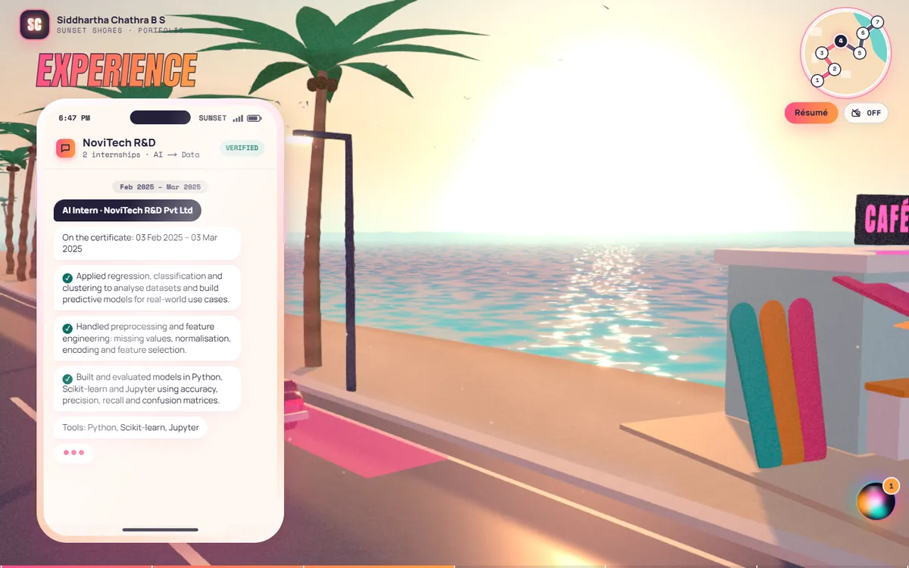
      <h3>04 · Beach Café</h3>
      My internships told as a <b>Messages</b> thread that types itself in as you scroll, with the real certificates attached.
    </td>
  </tr>
  <tr>
    <td width="50%" valign="top">
      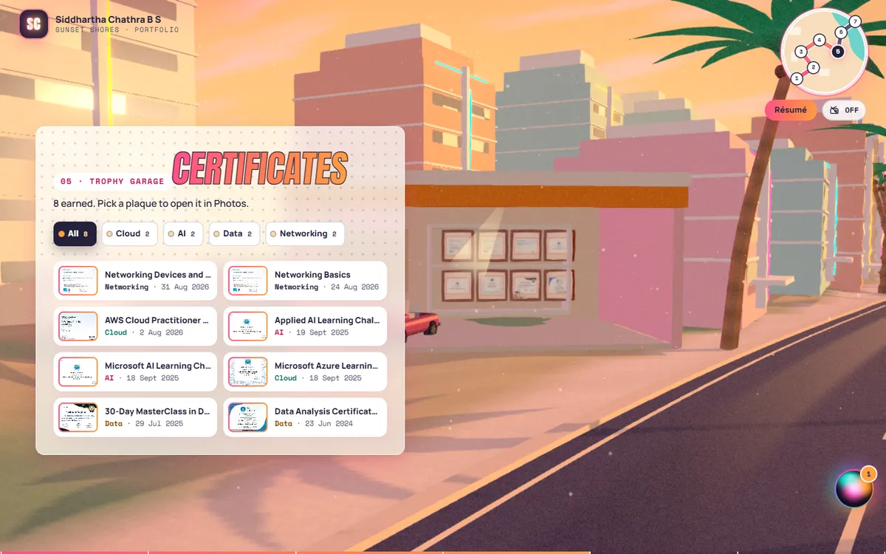
      <h3>05 · Trophy Garage</h3>
      Certificates hang as plaques in a garage trophy cabinet. Filter them by Cloud, AI, Data or Networking, and open any one in the Photos app.
    </td>
    <td width="50%" valign="top">
      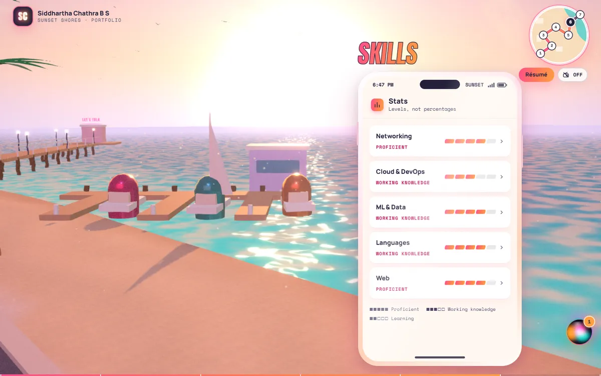
      <h3>06 · Marina</h3>
      Skills as a <b>Stats</b> app with honest levels (proficient, working knowledge, learning), never made-up percentages.
    </td>
  </tr>
  <tr>
    <td width="50%" valign="top">
      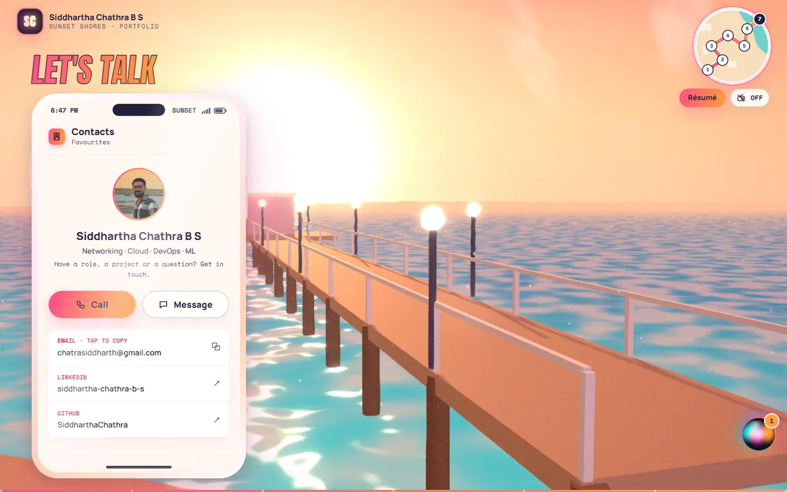
      <h3>07 · The Pier</h3>
      The end of the road. The <b>Contacts</b> card: call (copies my email), message, LinkedIn and GitHub.
    </td>
    <td width="50%" valign="top">
      <h3>💬 Sid's Assistant</h3>
      A Siri-style orb in the corner opens a chat with an AI assistant that answers questions about my work. It's grounded only in my résumé and this site's content, streams its answers, and says so when it doesn't know.
      <br><br>
      <h3>📻 Radio</h3>
      Flip the radio on for <i>"Sunset Shores Radio"</i>, an original synthwave track composed and synthesised in code.
    </td>
  </tr>
</table>

---

## ✨ Highlights

<table>
  <tr>
    <td width="33%" valign="top">
      <h4>🎥 A camera that drives</h4>
      Scroll position maps onto a spline along the coastal highway, with eased stops at every section. It reverses exactly when you scroll back.
    </td>
    <td width="33%" valign="top">
      <h4>📱 Sunset OS</h4>
      One phone component powers six apps. It tilts toward your cursor on desktop and becomes native full-screen UI on phones.
    </td>
    <td width="33%" valign="top">
      <h4>🌇 Golden-hour rendering</h4>
      Soft sun shadows, windows that reflect the live sky, a lit asphalt road, bloom, god rays, heat haze and a warm film grade.
    </td>
  </tr>
  <tr>
    <td valign="top">
      <h4>🚗 Living city</h4>
      Traffic follows a car-following model (cars keep their distance and brake behind slower cars), follows the road's curves, and climbs the flyover ramps.
    </td>
    <td valign="top">
      <h4>⚡ Adaptive quality</h4>
      Picks a tier from your GPU, then adjusts render resolution live to hold the frame rate, falling back to postcards on low-end devices.
    </td>
    <td valign="top">
      <h4>♿ Accessible</h4>
      Keyboard navigation, focus traps, ARIA throughout, reduced-motion support, and every colour pairing checked for WCAG AA. Lighthouse Accessibility 100.
    </td>
  </tr>
</table>

---

## 📱 On your phone

On a phone **the site is the phone**. The 3D coast sits in a cinematic scene window at the top, and Sunset OS apps fill the screen below it, with a dock for navigation.

<div align="center">
  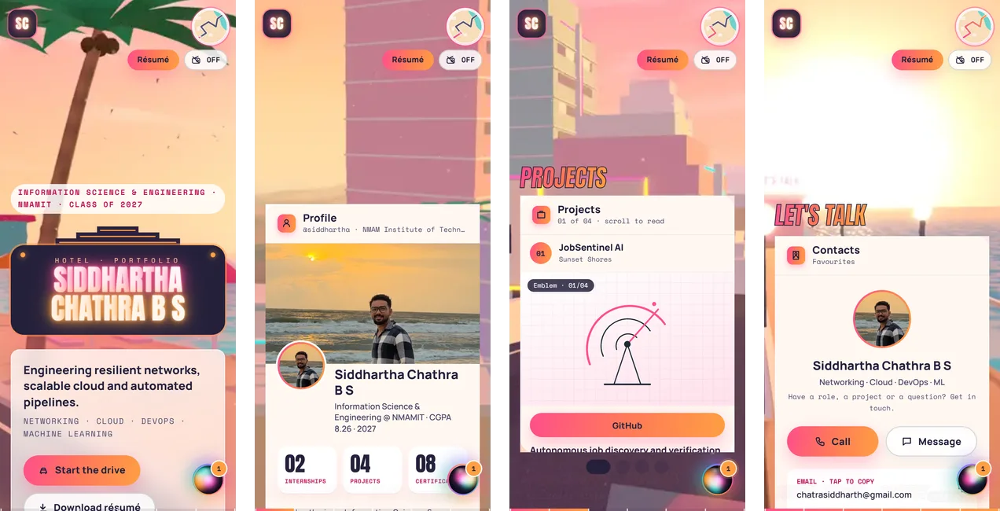
</div>

<table>
  <tr>
    <td width="33%" valign="top">
      <h4>🧭 Native navigation</h4>
      A Sunset OS dock (Home, Projects, Work, Certs, Contact, More) that hides while you scroll down. Tap the minimap for a full-screen map and tap any stop to drive there.
    </td>
    <td width="33%" valign="top">
      <h4>🪧 Swipeable billboards</h4>
      Projects slide sideways in the scene window while the app below swaps screens. Swipe the scene or scroll the page; they stay in sync. "Read more" opens the full case study in a bottom sheet.
    </td>
    <td width="33%" valign="top">
      <h4>🏆 Touch-first details</h4>
      A snap carousel of certificate plaques (the garage spotlight follows the one in the centre), a Photos viewer with swipe, pinch and double-tap zoom and swipe-down to close, and skills that expand inline.
    </td>
  </tr>
  <tr>
    <td valign="top">
      <h4>💬 Assistant as a bottom sheet</h4>
      Drag the orb to either edge and it stays there. The chat opens as a keyboard-aware sheet; swipe down or use Back to close it. Hold the mic to talk.
    </td>
    <td valign="top">
      <h4>🎮 Tuned for phones</h4>
      A smaller scene window, capped resolution and lighter effects hold about 60 fps on the medium tier even with the CPU slowed 4×. Low-end phones, Save-Data and reduced-motion get postcards framed for the scene window.
    </td>
    <td valign="top">
      <h4>👆 Built for thumbs</h4>
      Every tap target is at least 44px, body text is at least 16px, safe areas (notch, home indicator) are respected, and nothing depends on hover.
    </td>
  </tr>
</table>

<table>
  <tr>
    <td width="50%" valign="top">
      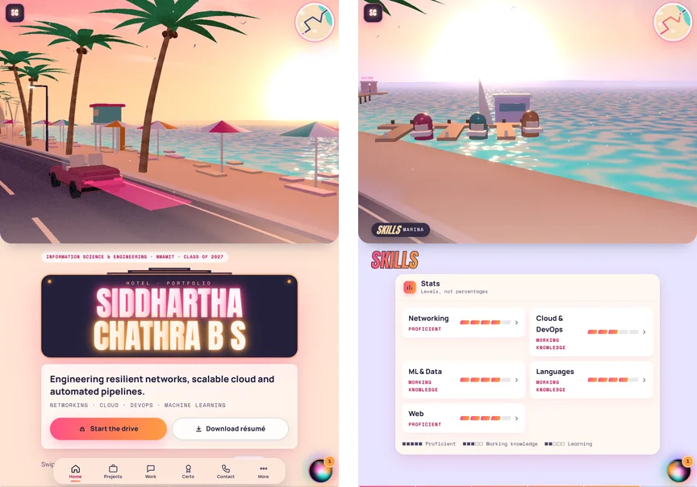
      <p align="center"><b>Tablet portrait</b>: a wide scene band, two-column apps</p>
    </td>
    <td width="50%" valign="top">
      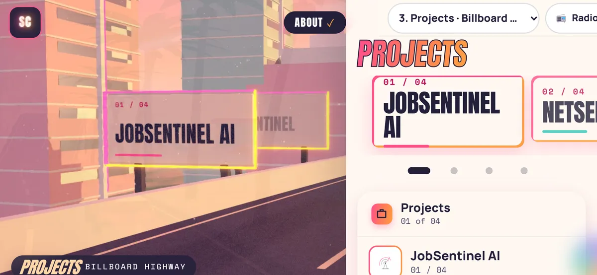
      <p align="center"><b>Phone landscape</b>: a full-bleed scene with an app sheet</p>
    </td>
  </tr>
</table>

Tested on iPhone SE, iPhone 15, iPhone 15 Pro Max, Pixel 7, Galaxy Fold, iPad Mini, iPad Air and iPad Pro (portrait and landscape) with real touch input in Playwright: swipes, drags, pinch and rotation. Details are in [RESPONSIVE_PROGRESS.md](RESPONSIVE_PROGRESS.md).

---

## 🚀 Run it locally

```bash
git clone https://github.com/SiddharthaChathra/sunset-shores-portfolio.git
cd sunset-shores-portfolio
npm install
cp .env.example .env.local   # optional: add GROQ_API_KEY for the assistant
npm run dev                  # → http://localhost:3000
```

You need Node 20 or newer. `npm run dev` and `npm run build` run the content pipeline first. Without a Groq key, the assistant politely says it can't connect, and the rest of the site works normally.

| Variable | Where | Purpose |
|---|---|---|
| `GROQ_API_KEY` | server only | Enables Sid's Assistant (`app/api/assistant/route.ts`). Never sent to the browser; `npm run check:secrets` proves it. |
| `GROQ_MODEL` | server only, optional | Any Groq chat model id (default `openai/gpt-oss-120b`). |
| `NEXT_PUBLIC_SITE_URL` | public | Canonical URL for metadata, sitemap and Open Graph tags. |

---

## 🔧 Under the hood

<details>
<summary><b>Tech stack</b></summary>

<br>

| Layer | Tools |
|---|---|
| Framework | Next.js 16 (App Router, Turbopack), React 19, TypeScript |
| 3D | three.js, React Three Fiber, drei, postprocessing (custom grade, heat-haze and flare effects) |
| UI and motion | Tailwind CSS 4, Motion, Lenis smooth scroll, zustand |
| AI | Groq streaming chat (grounded on a generated knowledge file, rate-limited) |
| Audio | Howler; all sound effects and music synthesised by scripts |
| Quality | Playwright (desktop, tablet and phone, plus axe), Lighthouse, a contrast checker, bundle budgets |

</details>

<details>
<summary><b>Project layout</b></summary>

<br>

```
app/            layout, page, /api/assistant, /credits, robots, sitemap, OG image
assets/         source files: résumé, certificates, internship letters, profile photo
content/        typed content (projects, experience, skills, profile) + generated JSON
lib/            store, scroll driver, quality tiers, audio, camera rig state
scene/          Stage, CameraRig, Sky, Terrain, fx/ (materials, effects), props/ (road, cars, palms, buildings), scenes/ (one per stop)
theme/          design tokens (Vice Sunset)
ui/             HUD, loading screen, phone (Sunset OS), sections, lightbox, companion
scripts/        content pipeline, stills capture, audio + music synthesis, diagnostics
tests/          Playwright specs
```

</details>

<details>
<summary><b>Content pipeline</b></summary>

<br>

Drop files into `assets/` and rebuild. The pipeline produces thumbnails and plaque textures, extracts the résumé text, crops the profile photo, and regenerates the assistant's knowledge.

```
assets/
  resume.pdf           → "Download résumé" + assistant knowledge
  profile.jpg          → profile picture + sunset cover (framing in content/profile.ts)
  certificates/*.pdf   → plaques in the Trophy Garage
  internships/*.pdf    → attachments in the Messages thread
```

Titles, issuers, dates and categories come from `content/certificate-overrides.json`. Projects, experience, skills and profile text live in `content/*.ts` as typed data; components never hard-code copy.

</details>

<details>
<summary><b>Quality tiers</b></summary>

<br>

| Tier | When | What renders |
|---|---|---|
| **high** | Discrete or strong GPUs | Sun shadows, full post-processing (god rays, heat haze, bloom, outline, chromatic aberration, SMAA), sand detail |
| **medium** | Integrated GPUs, unknown desktop GPUs | Bloom + warm grade, window reflections, no shadows |
| **low** | No WebGL, software rendering, weak GPUs, `prefers-reduced-motion` | No live canvas: postcards of every scene with CSS parallax |

A live guard lowers render resolution in small steps when the frame rate drops and raises it back when there's headroom. It only changes tier when even the lowest resolution can't keep up. Force a tier with `?tier=high|medium|low`.

</details>

<details>
<summary><b>Scripts</b></summary>

<br>

| Script | What it does |
|---|---|
| `npm run content` | Asset pipeline (`scripts/build-content.mts`) |
| `npm run lint` · `npm run typecheck` · `npm run build` | Static checks and production build |
| `npm run test:e2e` | Playwright on the production build: every stop on desktop, FPS, shader compilation, projects sync, assistant, lightbox, low tier, axe, plus `tests/mobile.spec.ts` (10 phones/tablets with real touch: layout, swipe sync, dock and map, assistant sheet, Photos gestures) |
| `npx tsx scripts/device-audit.mts <dir>` | Screenshots every section on the phone/tablet matrix and checks overflow, tap targets and text size |
| `npm run lighthouse` | Lighthouse (add `--mobile` for the mobile preset) |
| `npm run check:secrets` | Asserts no secret appears in the client bundle |
| `npm run capture:stills` | Regenerates the postcard stills, loading-screen art and the Open Graph image |
| `npm run audio` | Re-synthesises the sound effects and the radio music |
| `node scripts/contrast.mjs` | WCAG contrast check for every design-token pairing |
| `node scripts/budget.mjs` | Initial-route JS (≤ 350 KB gzipped) and 3D asset (≤ 8 MB) budgets |

</details>

<details>
<summary><b>Deploying to Vercel</b></summary>

<br>

1. Import this repository in Vercel. Next.js is detected automatically.
2. Add `GROQ_API_KEY` (optionally `GROQ_MODEL`) and `NEXT_PUBLIC_SITE_URL` under **Settings → Environment Variables**.
3. Deploy. `prebuild` regenerates `public/assets` and `content/generated` from `assets/`.

The assistant's rate limit (20 requests per IP per 10 minutes) is in-memory per instance. For a strict global limit, back it with a KV store.

</details>

<details>
<summary><b>Using your own radio music</b></summary>

<br>

Replace `public/audio/radio.mp3` with your track (MP3, 128–192 kbps, stereo, 1.5–4 minutes, loopable, under about 4 MB), then delete `public/audio/radio.json` so the whole file loops. Credit it in `CREDITS.md`. `npm run audio` regenerates the original track.

</details>

---

## 👋 Say hello

<div align="center">

**Siddhartha Chathra B S**: Information Science & Engineering at NMAMIT, class of 2027.
Networking · Cloud · DevOps · Machine learning.

<p>
  <a href="mailto:chatrasiddharth@gmail.com"></a>
  <a href="https://www.linkedin.com/in/siddhartha-chathra-b-s-8954b4325"></a>
  <a href="https://github.com/SiddharthaChathra"></a>
</p>

<sub>Everything in Sunset Shores is original or procedural. See <a href="CREDITS.md">CREDITS.md</a>.</sub>

</div>
